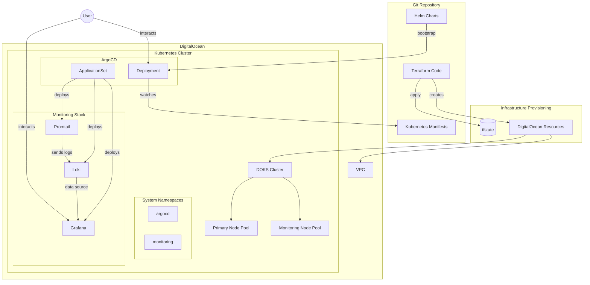

# Kubernetes Prototype Design Document
## DigitalOcean Infrastructure with Terraform, Helm, ArgoCD, and Grafana Stack

## Executive Summary

This document outlines the design for a prototype Kubernetes cluster on DigitalOcean, incorporating Infrastructure as Code (IaC) with Terraform, application deployment with Helm, GitOps with ArgoCD, and monitoring with the Grafana stack (Grafana, Loki, and Promtail). This prototype will serve as a foundation for a production-ready environment while validating the architectural choices and operational patterns.

## Architecture Overview

The proposed architecture follows cloud-native and GitOps principles, with infrastructure defined as code, declarative application management, and comprehensive observability. The system consists of four primary components:

1. **Infrastructure Layer** (Terraform + DigitalOcean)
2. **Package Management Layer** (Helm)
3. **Continuous Delivery Layer** (ArgoCD)
4. **Observability Layer** (Grafana, Loki, Promtail)

### System Architecture Diagram



## Component Details

### 1. Infrastructure Layer

**Technology:** Terraform with DigitalOcean Provider

**Components:**
- VPC for network isolation
- DOKS (DigitalOcean Kubernetes Service) cluster
- Two node pools:
  - Primary pool: 3x Standard nodes (4 vCPU, 8GB RAM)
  - Monitoring pool: 2x CPU-Optimized nodes (4 vCPU, 8GB RAM)
- DigitalOcean Load Balancers
- DigitalOcean Volumes for persistent storage

**Design Considerations:**
- Remote state storage using DigitalOcean Spaces or similar
- Modular Terraform structure for reusability
- Separate variable definitions for different environments
- Tags and labels for resource organization and cost tracking

### 2. Package Management Layer

**Technology:** Helm

**Components:**
- Helm charts for ArgoCD
- Helm charts for Grafana stack (Grafana, Loki, Promtail)
- Custom values files for environment-specific configurations

**Design Considerations:**
- Use of official Helm repositories where possible
- Versioned dependencies to ensure reproducibility
- Structured values files with comments for documentation
- Templating for dynamic configuration generation

### 3. Continuous Delivery Layer

**Technology:** ArgoCD

**Components:**
- ArgoCD server and components in dedicated namespace
- Application definitions for managed workloads
- Repository connections to Git sources
- RBAC configuration for access control

**Design Considerations:**
- Bootstrap ArgoCD using Helm initially, then self-manage
- Application of App-of-Apps pattern for scalability
- Automated sync policies with health checks
- Progressive delivery strategies (optional for later phases)

### 4. Observability Layer

**Technology:** Grafana, Loki, Promtail

**Components:**
- Grafana for visualization and dashboarding
- Loki for log aggregation and querying
- Promtail for log collection and forwarding

**Design Considerations:**
- Persistent storage for logs and dashboards
- Node affinity rules to place monitoring components on dedicated nodes
- Resource limits and requests for predictable performance
- Retention policies for managing storage growth

## Implementation Workflow

### Phase 1: Repository Setup
1. Create Git repository structure
2. Define branching strategy and access controls
3. Set up documentation templates

### Phase 2: Infrastructure Provisioning
1. Develop Terraform modules for DigitalOcean resources
2. Configure remote state storage
3. Create deployment pipeline for infrastructure changes
4. Provision core infrastructure (VPC, networking)
5. Deploy Kubernetes cluster and node pools

### Phase 3: Core Services Deployment
1. Bootstrap Kubernetes configuration (namespaces, RBAC)
2. Deploy ArgoCD using Helm
3. Configure ArgoCD to watch Git repository
4. Create initial Application manifests

### Phase 4: Observability Stack
1. Deploy Loki and Promtail using ArgoCD
2. Deploy Grafana using ArgoCD
3. Configure data sources and basic dashboards
4. Set up log aggregation for system components

### Phase 5: Validation and Documentation
1. Verify end-to-end functionality
2. Document architecture and operational procedures
3. Capture lessons learned and improvement areas

## Directory Structure

```
prototype-k8s/
├── terraform/
│   ├── modules/
│   │   ├── vpc/
│   │   ├── kubernetes/
│   │   └── storage/
│   ├── environments/
│   │   ├── dev/
│   │   └── staging/
│   └── README.md
├── kubernetes/
│   ├── bootstrap/
│   │   └── argocd/
│   ├── apps/
│   │   ├── monitoring/
│   │   │   ├── grafana/
│   │   │   ├── loki/
│   │   │   └── promtail/
│   │   └── system/
│   └── README.md
├── helm-values/
│   ├── argocd/
│   ├── grafana/
│   ├── loki/
│   └── promtail/
├── docs/
│   ├── architecture.md
│   ├── operations.md
│   └── diagrams/
└── README.md
```

## Security Considerations

### Infrastructure Security
- VPC isolation for network segmentation
- Firewall rules to restrict access
- Encrypted etcd for Kubernetes cluster
- Regular security updates and patching

### Application Security
- RBAC for Kubernetes and ArgoCD access control
- Service account minimum privileges
- Network policies for pod-to-pod communication
- Resource quotas and limits

### Data Security
- Encrypted persistent volumes
- Backup and disaster recovery procedures
- Secrets management (future enhancement)
- Audit logging

## Operational Considerations

### Monitoring and Alerting
- System and application metrics collection
- Log aggregation and analysis
- Alert configuration for critical components
- Dashboard creation for visibility

### Backup and Recovery
- Kubernetes resource backups
- Persistent volume snapshots
- Configuration backups
- Documented recovery procedures

### Scaling
- Horizontal pod autoscaling for applications
- Node autoscaling for worker pools
- Resource allocation planning

## Cost Estimation

| Component | Size | Monthly Cost (Approx.) |
|-----------|------|------------------------|
| DOKS Control Plane | Managed | $10 |
| Worker Nodes (3) | s-4vcpu-8gb | $126 |
| Monitoring Nodes (2) | c-4 | $168 |
| Block Storage (80GB) | n/a | $8 |
| Load Balancers (2) | n/a | $20 |
| Spaces (for Terraform state) | 250GB | $5 |
| **Total (Estimated)** | | **$337** |

*Note: Prices are based on DigitalOcean's rates as of March 2025 and may vary.*

## Future Enhancements

- Secret management with Sealed Secrets or Vault
- CI/CD pipeline integration with GitHub Actions or GitLab CI
- Automated testing framework
- Multi-environment promotion workflow
- Disaster recovery testing and validation
- Performance optimization and cost reduction strategies

## Success Criteria

The prototype will be considered successful when:

1. Infrastructure can be reliably provisioned and modified using Terraform
2. ArgoCD successfully manages application deployments from Git
3. The Grafana stack provides observable insights into system performance
4. Operations can be performed using GitOps workflows
5. The architecture proves to be maintainable and extensible

## Conclusion

This prototype design establishes a foundation for a production-ready Kubernetes platform on DigitalOcean. By leveraging Terraform for infrastructure provisioning, Helm for package management, ArgoCD for GitOps-based delivery, and the Grafana stack for observability, the system follows modern cloud-native principles while remaining practical to implement and operate. The modular approach allows for incremental improvements and extensions as requirements evolve.
